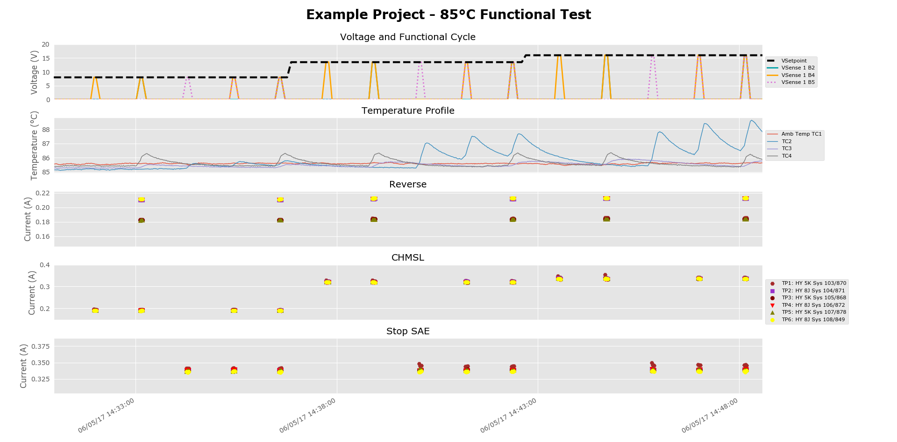
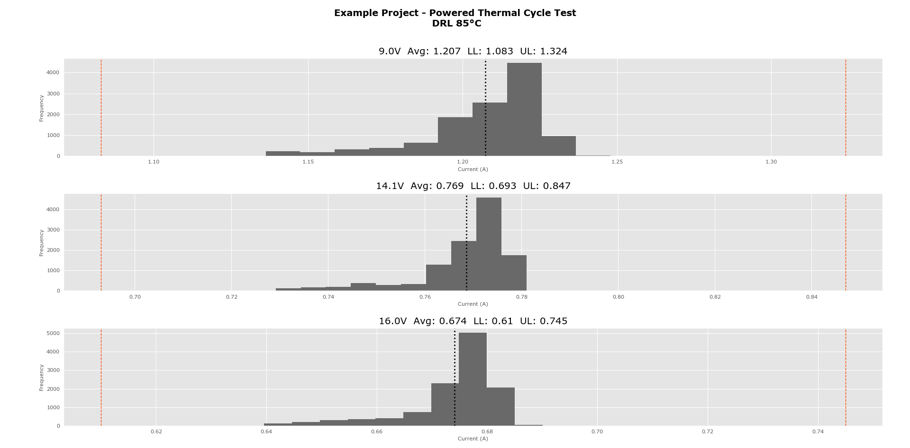
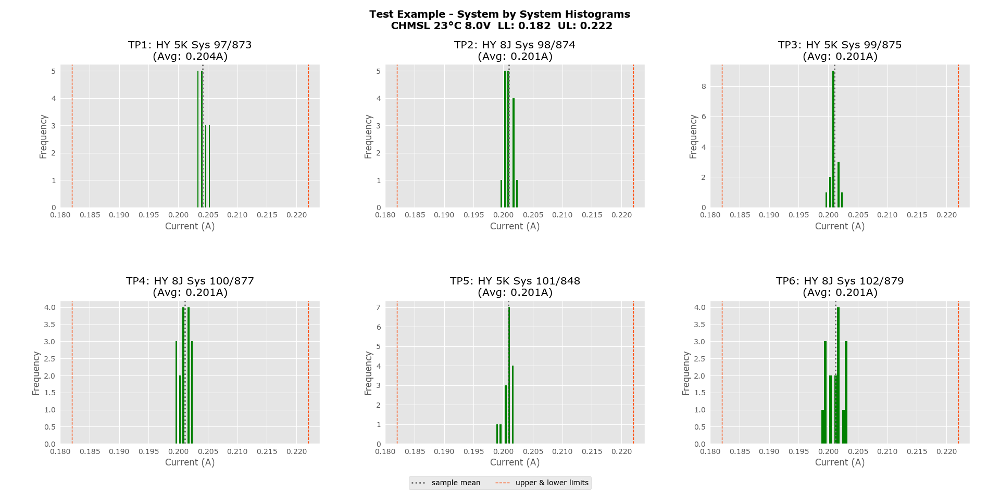

# DV Station Test Analysis

This python program analyzes raw environmental test data for automotive lighting systems. The tests expose lighting systems to various temperature profiles while the systems are powered. Each test system is comprised of many modules (e.g. - Turn, DRL, Park, Outage, etc.) and can be ran in different modes (e.g. - Park+Turn, Turn only, DRL+Park, etc.). These various modes are excited at different voltages throughout testing. The primary function of this project is to analyze the distributions of current for each temperature/mode/voltage condition and compare them to design current limits. 


## Getting Started

Python (version 3.5 or later) must be installed on your computer in order to use this data analysis program: https://www.python.org/

### Dependencies

Download this repository's code to your local environment. Ensure you have pip installed and from the command line run the following to collect the required python packages:

```
pip install -r requirements.txt
```


## The DV Test Station
The raw data that this program analyzes is produced by our DV Test Stations. These test stations consist of 2 power supplies, 2 DAQ systems, and 6 pc boards. The test systems are wired to the boards and currents are measured across high precision shunt resistors. Each board is used for a single module in the system. For instance, a lighting project may be set up on the boards of a DV Test Station like this: 

```
Board 1 - Low Beam
Board 2 - High Beam
Board 3 - DRL
Board 4 - Park
Board 5 - Turn
Board 6 - Outage
```

A Labview program defines the functional cycle of testing (which modules are powered and when) and outputs raw DAQ voltage and current data of each system for each board. A single board's raw data looks like this: 
```
| Date     | Time       | Amb Temp TC1 | TC2    | TC3    | TC4    | VSetpoint | VSense 1 | VSense 2 | Board on/off | TP1: System 82 | TP2: System 83 | TP3: System 84 | TP4: System 85 | TP5: System 86 | TP6: System 87 | TP7: System 88 | TP8: System 89 | TP9: System 90 | TP10: System 91 | TP11: System 92 | TP12: System 93 |
|----------|------------|--------------|--------|--------|--------|-----------|----------|----------|--------------|----------------|----------------|----------------|----------------|----------------|----------------|----------------|----------------|----------------|-----------------|-----------------|-----------------|
| 2/2/2017 | 4:29:32 PM | 22.955       | 23.367 | 22.785 | 22.281 | 9         | 9.009    | 9.118    | 1            | 0.49788        | 0.49691        | 0.49941        | 0.48962        | 0.4949         | 0.49386        | 0.49448        | 0.49518        | 0.49372        | 0.49802         | 0.49865         | 0.48726         |
| 2/2/2017 | 4:29:33 PM | 22.943       | 23.364 | 22.764 | 22.266 | 9         | 9.012    | 9.019    | 1            | 0.49851        | 0.49754        | 0.50004        | 0.49011        | 0.49566        | 0.49441        | 0.4949         | 0.49587        | 0.49441        | 0.49851         | 0.49927         | 0.48775         |
| 2/2/2017 | 4:29:34 PM | 22.949       | 23.37  | 22.785 | 22.284 | 9         | 9.023    | 9.071    | 1            | 0.49879        | 0.49761        | 0.50011        | 0.49018        | 0.49573        | 0.49462        | 0.49511        | 0.49615        | 0.49455        | 0.49872         | 0.49927         | 0.48775         |
| 2/2/2017 | 4:29:35 PM | 22.943       | 23.391 | 22.776 | 22.272 | 9         | 9.015    | 9.122    | 1            | 0.49886        | 0.49775        | 0.50025        | 0.49025        | 0.49594        | 0.49469        | 0.49525        | 0.49608        | 0.49469        | 0.49879         | 0.4992          | 0.48789         |
| 2/2/2017 | 4:29:41 PM | 22.949       | 23.431 | 22.782 | 22.639 | 9         | 0.003    | 0.003    | 0            | OFF            | OFF            | OFF            | OFF            | OFF            | OFF            | OFF            | OFF            | OFF            | OFF             | OFF             | OFF             |
| 2/2/2017 | 4:29:42 PM | 22.965       | 23.456 | 22.764 | 22.629 | 9         | 0.003    | 0.003    | 0            | OFF            | OFF            | OFF            | OFF            | OFF            | OFF            | OFF            | OFF            | OFF            | OFF             | OFF             | OFF             |
| 2/2/2017 | 4:29:43 PM | 22.961       | 23.45  | 22.767 | 22.595 | 9         | 0.003    | 0.003    | 0            | OFF            | OFF            | OFF            | OFF            | OFF            | OFF            | OFF            | OFF            | OFF            | OFF             | OFF             | OFF             |
| 2/2/2017 | 4:29:44 PM | 22.968       | 23.465 | 22.785 | 22.614 | 9         | 0.003    | 0.003    | 0            | OFF            | OFF            | OFF            | OFF            | OFF            | OFF            | OFF            | OFF            | OFF            | OFF             | OFF             | OFF             |

(and so on ...)

```

## Current Limits
For each lighting project current limits are established for the various temperature/mode/voltage conditions. These limits can be used for any particular environmental test. These limits are stored in an excel file and pulled by the program into a simple dictionary. Limits are excellent for comparing the measured currents to an expected or acceptable range. They also aid in recognizing subtle failures. 

Not all LEDs are created equal. Some LEDs are more efficient than others (lower current will produce same light output) and so LEDs are allocated into different bins. LED binning is accounted for in the limits files so that different current limits can be used for samples of the same module type but different LED bin. 

## Analysis

The analysis consists of four components:
1. Temporal Plotting
2. Current Histograms
3. Summary Tables with basic statisitcs and comparison to limits 
4. Out of spec data

### 1) Temporal Plotting
Outputs a set of temporal subplots:
* Voltage and functional cycle
* Temperature profile
* Current scans for each mode that is present

Here is an example:



### 2) Current Histograms
Histograms can be created to visualize the distribution of currents at different test conditions. If provided, limits are drawn as vertical dashed lines. These can be run on the test population as a whole or a system by system basis. 

Here is an example of a test population histogram:



Here is an example of a system by system histogram:



### 3) Summary Tables
An excel file is created with the basic statistics for the various temperature/mode/voltage conditions for each system. A new tab is created for each test temperature the user wishes to analyze. 

### 4) Out of spec data
A text file containing all the raw out of spec data is created. The file lists the data by condition (temperature/mode/voltage) so the user knows what currents were out of specification. No file is created if there is no out of spec data for the analyzed test data. 


## Running the tests

E2E testing is being added to validate accuracy of analysis

```
Examples...
```


## Built With

* [Pandas](http://pandas.pydata.org/) - Data wrangling and processing
* [Matplotlib](http://matplotlib.org/) - Plotting and histograms
* [XlsWriter](http://xlsxwriter.readthedocs.io/) - Creates analysis tables
* [Openpyxl](https://openpyxl.readthedocs.io/en/default/) - Pulling current limits from excel files


## Authors

* **Sam Bruno** - [Osram Automotive](https://github.com/OsramAutomotive)
