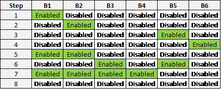

# Overview

This program analyzes raw environmental test data for automotive lighting systems. The tests expose lighting systems to various temperature profiles while the systems are powered. Each test system is comprised of many modules (e.g. - Turn, DRL, Park, Outage, etc.) and can be run in different modes (e.g. – Park only, Turn only, Park+Turn, DRL+Park, etc.). These various modes are excited at different voltages throughout testing. The primary function of this project is to analyze the distributions of current for each temperature/mode/voltage condition.


## Installing

For development, Python (any subversion of 3.5) must be installed on your computer in order to use this data analysis program:  [https://www.python.org/](https://www.python.org/).  If you are only interested in running the program then you may use the executable. The latest Averna compatible executable is available on the network. 

### Dependencies

Download this repository&#39;s code to your local environment. Ensure you have pip installed and from the command line run the following command to collect the required python packages:

```
pip install -r requirements.txt
```

### Building an executable

To build a standalone executable, navigate to the project root folder in the terminal and run the command:

```
pyinstaller __main__.spec
```

This command will create a series of log and working files in the &quot;build&quot; folder and most importantly an executable in the &quot;dist&quot; folder. This &quot;dist&quot; folder contains everything required to run the software; the executable, dlls, and other files the program relies upon. This folder may be copied to any computer with a Windows operating system and the executable may be run from there.

## The DV Test Station
The raw data that this program analyzes is produced by our DV Test Stations. These test stations typically consist of at least 2 power supplies, 2 DAQ systems, and 6 measurement boards (current or outage boards). However, the stations and Labview software support scalibility so additional measurement boards may be used. The test systems are wired to the boards and currents are measured across high precision shunt resistors. Each board is used for a single module in the system. For instance, a lighting project may be set up on the boards of a DV Test Station like this: 

```
Board 1 - Low Beam
Board 2 - High Beam
Board 3 - DRL
Board 4 - Park
Board 5 - Turn
Board 6 - Outage
Board 7 - L2
```

A Labview program defines the functional cycle of testing (which modules are powered and when) and outputs raw DAQ voltage and current data of each system for each board. The output format is a text file that contains hundreds to thousands of rows of data. A few rows of a raw output data file looks like this: 


```
| Date      | Time    | Temp tc3: Cabinet | Temp tc1: chamber | Temp tc2: LB HB LDM | Temp tc4: Room amb | Temp tc5: Ktype | Temp tc6: Ttype | Temp tc7: Jtype | Vsetpoint | B1 ON/OFF | B1 VSense1 | B1 VSense2 | B1 TP1: S1 a | B1 TP2: s2 | B1 TP3: s3 | B1 TP4: s4 | B1 TP5: s5 | B1 TP6: s6 | B1 TP7: s7 | B1 TP8: s8 | B1 TP9: s9 | B1 TP10: s10 | B1 TP11: s11 | B1 TP12: s12 | B2 ON/OFF | B2 VSense1 | B2 VSense2 | B2 TP1: S1 a | B2 TP2: s2 | B2 TP3: s3 | B2 TP4: s4 | B2 TP5: s5 | B2 TP6: s6 | B2 TP7: s7 | B2 TP8: s8 | B2 TP9: s9 | B2 TP10: s10 | B2 TP11: s11 | B2 TP12: s12 | B3 ON/OFF | B3 VSense1 | B3 VSense2 | B3 TP1: S1 a | B3 TP2: s2 | B3 TP3: s3 | B3 TP4: s4 | B3 TP5: s5 | B3 TP6: s6 | B3 TP7: s7 | B3 TP8: s8 | B3 TP9: s9 | B3 TP10: s10 | B3 TP11: s11 | B3 TP12: s12 | B4 ON/OFF | B4 VSense1 | B4 VSense2 | B4 TP1: S1 a | B4 TP2: s2 | B4 TP3: s3 | B4 TP4: s4 | B4 TP5: s5 | B4 TP6: s6 | B4 TP7: s7 | B4 TP8: s8 | B4 TP9: s9 | B4 TP10: s10 | B4 TP11: s11 | B4 TP12: s12 | B5 ON/OFF | B5 VSense1 | B5 VSense2 | B5 TP1: S1 a | B5 TP2: s2 | B5 TP3: s3 | B5 TP4: s4 | B5 TP5: s5 | B5 TP6: s6 | B5 TP7: s7 | B5 TP8: s8 | B5 TP9: s9 | B5 TP10: s10 | B5 TP11: s11 | B5 TP12: s12 | B6 ON/OFF | B6 TP1: S1 a | B6 TP2: s2 | B6 TP3: s3 | B6 TP4: s4 | B6 TP5: s5 | B6 TP6: s6 | B6 TP7: s7 | B6 TP8: s8 | B6 TP9: s9 | B6 TP10: s10 | B6 TP11: s11 | B6 TP12: s12 | B6 TP13: L2-1 | B6 TP14: L2-2 | B6 TP15: L2-3 | B6 TP16: L2-4 | B6 TP17: L2-5 | B6 TP18: L2-6 | B6 TP19: L2-7 | B6 TP20: L2-8 | B6 TP21: L2-9 | B6 TP22: L2-10 | B6 TP23: L2-11 | B6 TP24: L2-12 | B7 ON/OFF | B7 TP1: L2-1 | B7 TP2: L2-2 | B7 TP3: L2-3 | B7 TP4: L2-4 | B7 TP5: L2-5 | B7 TP6: L2-6 | B7 TP7: L2-7 | B7 TP8: L2-8 | B7 TP9: L2-9 | B7 TP10: L2-10 | B7 TP11: L2-11 | B7 TP12: L2-12 |
|-----------|---------|-------------------|-------------------|---------------------|--------------------|-----------------|-----------------|-----------------|-----------|-----------|------------|------------|--------------|------------|------------|------------|------------|------------|------------|------------|------------|--------------|--------------|--------------|-----------|------------|------------|--------------|------------|------------|------------|------------|------------|------------|------------|------------|--------------|--------------|--------------|-----------|------------|------------|--------------|------------|------------|------------|------------|------------|------------|------------|------------|--------------|--------------|--------------|-----------|------------|------------|--------------|------------|------------|------------|------------|------------|------------|------------|------------|--------------|--------------|--------------|-----------|------------|------------|--------------|------------|------------|------------|------------|------------|------------|------------|------------|--------------|--------------|--------------|-----------|--------------|------------|------------|------------|------------|------------|------------|------------|------------|--------------|--------------|--------------|---------------|---------------|---------------|---------------|---------------|---------------|---------------|---------------|---------------|----------------|----------------|----------------|-----------|--------------|--------------|--------------|--------------|--------------|--------------|--------------|--------------|--------------|----------------|----------------|----------------|
| 5/11/2018 | 30:36.2 | 27.926            | -40.744           | -36.956             | 22.858             | 23.011          | 22.798          | 22.364          | 9         | 0         | OFF        | OFF        | OFF          | OFF        | OFF        | OFF        | OFF        | OFF        | OFF        | OFF        | OFF        | OFF          | OFF          | OFF          | 0         | OFF        | OFF        | OFF          | OFF        | OFF        | OFF        | OFF        | OFF        | OFF        | OFF        | OFF        | OFF          | OFF          | OFF          | 0         | OFF        | OFF        | OFF          | OFF        | OFF        | OFF        | OFF        | OFF        | OFF        | OFF        | OFF        | OFF          | OFF          | OFF          | 0         | OFF        | OFF        | OFF          | OFF        | OFF        | OFF        | OFF        | OFF        | OFF        | OFF        | OFF        | OFF          | OFF          | OFF          | 0         | OFF        | OFF        | OFF          | OFF        | OFF        | OFF        | OFF        | OFF        | OFF        | OFF        | OFF        | OFF          | OFF          | OFF          | 1         | 0            | 0          | -0.005596  | 0.005596   | -0.005596  | -0.005596  | 0.005596   | 0          | -0.011191  | 0.005596     | 0.005596     | 0.005596     | 0.054071      | 0.010814      | -0.070292     | 0.075699      | -0.005407     | -0.064885     | 0.075699      | -0.032442     | 0.005407      | 0.027035       | -0.081106      | 0.075699       | 1         | 0.348941     | 0.346236     | 0.340826     | 0.339203     | 0.339203     | 0.344072     | 0.347859     | 0.340285     | 0.344072     | 0.341908       | 0.341367       | 0.340826       |
| 5/11/2018 | 30:42.2 | 27.948            | -41.329           | -37.217             | 22.943             | 22.979          | 22.821          | 22.782          | 9         | 0         | OFF        | OFF        | OFF          | OFF        | OFF        | OFF        | OFF        | OFF        | OFF        | OFF        | OFF        | OFF          | OFF          | OFF          | 0         | OFF        | OFF        | OFF          | OFF        | OFF        | OFF        | OFF        | OFF        | OFF        | OFF        | OFF        | OFF          | OFF          | OFF          | 0         | OFF        | OFF        | OFF          | OFF        | OFF        | OFF        | OFF        | OFF        | OFF        | OFF        | OFF        | OFF          | OFF          | OFF          | 0         | OFF        | OFF        | OFF          | OFF        | OFF        | OFF        | OFF        | OFF        | OFF        | OFF        | OFF        | OFF          | OFF          | OFF          | 0         | OFF        | OFF        | OFF          | OFF        | OFF        | OFF        | OFF        | OFF        | OFF        | OFF        | OFF        | OFF          | OFF          | OFF          | 1         | 0            | 0.011191   | -0.005596  | -0.005596  | 0.011191   | 0          | -0.005596  | 0.011191   | 0          | 0            | -0.005596    | -0.005596    | 0             | 0.070292      | -0.086513     | 0.027035      | -0.010814     | -0.081106     | 0.032442      | -0.010814     | -0.027035     | 0.064885       | -0.075699      | 0.010814       | 1         | 0.350023     | 0.341908     | 0.339745     | 0.338121     | 0.338662     | 0.341367     | 0.350023     | 0.340826     | 0.344613     | 0.343531       | 0.342449       | 0.342449       |
| 5/11/2018 | 30:48.2 | 27.888            | -41.437           | -37.351             | 23.179             | 23.163          | 22.759          | 22.714          | 9         | 0         | OFF        | OFF        | OFF          | OFF        | OFF        | OFF        | OFF        | OFF        | OFF        | OFF        | OFF        | OFF          | OFF          | OFF          | 0         | OFF        | OFF        | OFF          | OFF        | OFF        | OFF        | OFF        | OFF        | OFF        | OFF        | OFF        | OFF          | OFF          | OFF          | 0         | OFF        | OFF        | OFF          | OFF        | OFF        | OFF        | OFF        | OFF        | OFF        | OFF        | OFF        | OFF          | OFF          | OFF          | 0         | OFF        | OFF        | OFF          | OFF        | OFF        | OFF        | OFF        | OFF        | OFF        | OFF        | OFF        | OFF          | OFF          | OFF          | 0         | OFF        | OFF        | OFF          | OFF        | OFF        | OFF        | OFF        | OFF        | OFF        | OFF        | OFF        | OFF          | OFF          | OFF          | 1         | -0.005596    | 0          | 0          | 0          | 0.011191   | -0.005596  | -0.005596  | 0.005596   | -0.005596  | 0.005596     | -0.005596    | -0.011191    | -0.027035     | 0.075699      | -0.027035     | 0.005407      | 0.054071      | -0.081106     | 0.048664      | -0.010814     | -0.005407     | 0.081106       | -0.016221      | 0              | 1         | 0.349482     | 0.341908     | 0.340285     | 0.340285     | 0.340285     | 0.344072     | 0.350564     | 0.339203     | 0.342449     | 0.34299        | 0.338662       | 0.342449       |
| 5/11/2018 | 30:54.2 | 27.96             | -40.852           | -37.166             | 22.849             | 23.114          | 22.698          | 22.664          | 9         | 0         | OFF        | OFF        | OFF          | OFF        | OFF        | OFF        | OFF        | OFF        | OFF        | OFF        | OFF        | OFF          | OFF          | OFF          | 0         | OFF        | OFF        | OFF          | OFF        | OFF        | OFF        | OFF        | OFF        | OFF        | OFF        | OFF        | OFF          | OFF          | OFF          | 0         | OFF        | OFF        | OFF          | OFF        | OFF        | OFF        | OFF        | OFF        | OFF        | OFF        | OFF        | OFF          | OFF          | OFF          | 0         | OFF        | OFF        | OFF          | OFF        | OFF        | OFF        | OFF        | OFF        | OFF        | OFF        | OFF        | OFF          | OFF          | OFF          | 0         | OFF        | OFF        | OFF          | OFF        | OFF        | OFF        | OFF        | OFF        | OFF        | OFF        | OFF        | OFF          | OFF          | OFF          | 1         | 0            | -0.005596  | 0.005596   | 0.005596   | -0.005596  | -0.005596  | 0.005596   | 0.005596   | -0.005596  | 0.005596     | -0.005596    | 0.011191     | 0.03785       | 0.010814      | -0.005407     | -0.070292     | 0.081106      | -0.027035     | 0             | 0.03785       | -0.081106     | 0.059478       | 0.010814       | -0.064885      | 1         | 0.347318     | 0.342449     | 0.338121     | 0.340285     | 0.341367     | 0.340285     | 0.349482     | 0.341367     | 0.346236     | 0.344613       | 0.339745       | 0.341908       |
| 5/11/2018 | 30:59.2 | 28.249            | -40.453           | -37.084             | 22.902             | 23.098          | 22.698          | 22.556          | 9         | 1         | 8.95894    | 8.9173     | 1.70886      | 2.06444    | 2.01136    | 2.00075    | 2.04321    | 1.98483    | 2.09097    | 2.02198    | 2.06974    | 2.03259      | 2.02198      | 1.95829      | 0         | OFF        | OFF        | OFF          | OFF        | OFF        | OFF        | OFF        | OFF        | OFF        | OFF        | OFF        | OFF          | OFF          | OFF          | 0         | OFF        | OFF        | OFF          | OFF        | OFF        | OFF        | OFF        | OFF        | OFF        | OFF        | OFF        | OFF          | OFF          | OFF          | 0         | OFF        | OFF        | OFF          | OFF        | OFF        | OFF        | OFF        | OFF        | OFF        | OFF        | OFF        | OFF          | OFF          | OFF          | 0         | OFF        | OFF        | OFF          | OFF        | OFF        | OFF        | OFF        | OFF        | OFF        | OFF        | OFF        | OFF          | OFF          | OFF          | 0         | OFF          | OFF        | OFF        | OFF        | OFF        | OFF        | OFF        | OFF        | OFF        | OFF          | OFF          | OFF          | OFF           | OFF           | OFF           | OFF           | OFF           | OFF           | OFF           | OFF           | OFF           | OFF            | OFF            | OFF            | 1         | 0.349482     | 0.34299      | 0.341367     | 0.338662     | 0.338121     | 0.341367     | 0.347318     | 0.340285     | 0.344072     | 0.341367       | 0.341908       | 0.341908       |
| 5/11/2018 | 31:05.2 | 28.234            | -41.282           | -37.425             | 22.956             | 23.04           | 22.724          | 22.359          | 9         | 1         | 8.96952    | 8.91754    | 1.71417      | 2.05913    | 2.01136    | 2.00075    | 2.0379     | 1.97952    | 2.08036    | 2.02198    | 2.07505    | 2.0379       | 2.02198      | 1.97422      | 0         | OFF        | OFF        | OFF          | OFF        | OFF        | OFF        | OFF        | OFF        | OFF        | OFF        | OFF        | OFF          | OFF          | OFF          | 0         | OFF        | OFF        | OFF          | OFF        | OFF        | OFF        | OFF        | OFF        | OFF        | OFF        | OFF        | OFF          | OFF          | OFF          | 0         | OFF        | OFF        | OFF          | OFF        | OFF        | OFF        | OFF        | OFF        | OFF        | OFF        | OFF        | OFF          | OFF          | OFF          | 0         | OFF        | OFF        | OFF          | OFF        | OFF        | OFF        | OFF        | OFF        | OFF        | OFF        | OFF        | OFF          | OFF          | OFF          | 0         | OFF          | OFF        | OFF        | OFF        | OFF        | OFF        | OFF        | OFF        | OFF        | OFF          | OFF          | OFF          | OFF           | OFF           | OFF           | OFF           | OFF           | OFF           | OFF           | OFF           | OFF           | OFF            | OFF            | OFF            | 1         | 0.349482     | 0.346236     | 0.341367     | 0.33758      | 0.338662     | 0.342449     | 0.348941     | 0.340285     | 0.341367     | 0.341367       | 0.341367       | 0.341367       |
| 5/11/2018 | 31:11.2 | 28.202            | -42.01            | -37.735             | 22.905             | 23.089          | 22.795          | 22.294          | 9         | 1         | 8.95894    | 8.91784    | 1.72478      | 2.06444    | 2.01136    | 2.00075    | 2.0379     | 1.99014    | 2.08036    | 2.02198    | 2.07505    | 2.0379       | 2.01667      | 1.96891      | 0         | OFF        | OFF        | OFF          | OFF        | OFF        | OFF        | OFF        | OFF        | OFF        | OFF        | OFF        | OFF          | OFF          | OFF          | 0         | OFF        | OFF        | OFF          | OFF        | OFF        | OFF        | OFF        | OFF        | OFF        | OFF        | OFF        | OFF          | OFF          | OFF          | 0         | OFF        | OFF        | OFF          | OFF        | OFF        | OFF        | OFF        | OFF        | OFF        | OFF        | OFF        | OFF          | OFF          | OFF          | 0         | OFF        | OFF        | OFF          | OFF        | OFF        | OFF        | OFF        | OFF        | OFF        | OFF        | OFF        | OFF          | OFF          | OFF          | 0         | OFF          | OFF        | OFF        | OFF        | OFF        | OFF        | OFF        | OFF        | OFF        | OFF          | OFF          | OFF          | OFF           | OFF           | OFF           | OFF           | OFF           | OFF           | OFF           | OFF           | OFF           | OFF            | OFF            | OFF            | 1         | 0.352187     | 0.341367     | 0.339745     | 0.33758      | 0.339745     | 0.34299      | 0.3484       | 0.344613     | 0.345695     | 0.34299        | 0.340285       | 0.340826       |
| 5/11/2018 | 31:17.2 | 28.215            | -41.46            | -37.605             | 22.887             | 23.172          | 22.785          | 22.337          | 9         | 1         | 8.95894    | 8.91772    | 1.71417      | 2.05913    | 2.00606    | 2.00075    | 2.04321    | 1.99014    | 2.08036    | 2.01667    | 2.07505    | 2.04321      | 2.02729      | 1.96891      | 0         | OFF        | OFF        | OFF          | OFF        | OFF        | OFF        | OFF        | OFF        | OFF        | OFF        | OFF        | OFF          | OFF          | OFF          | 0         | OFF        | OFF        | OFF          | OFF        | OFF        | OFF        | OFF        | OFF        | OFF        | OFF        | OFF        | OFF          | OFF          | OFF          | 0         | OFF        | OFF        | OFF          | OFF        | OFF        | OFF        | OFF        | OFF        | OFF        | OFF        | OFF        | OFF          | OFF          | OFF          | 0         | OFF        | OFF        | OFF          | OFF        | OFF        | OFF        | OFF        | OFF        | OFF        | OFF        | OFF        | OFF          | OFF          | OFF          | 0         | OFF          | OFF        | OFF        | OFF        | OFF        | OFF        | OFF        | OFF        | OFF        | OFF          | OFF          | OFF          | OFF           | OFF           | OFF           | OFF           | OFF           | OFF           | OFF           | OFF           | OFF           | OFF            | OFF            | OFF            | 1         | 0.351105     | 0.341367     | 0.340826     | 0.338662     | 0.338121     | 0.341908     | 0.348941     | 0.339745     | 0.343531     | 0.343531       | 0.341908       | 0.342449       |

(and so on ...)
```


## **Current Limits**

For each lighting project current limits are established for the various temperature/mode/voltage conditions. These limits can be used for any particular environmental test. These limits are stored in an html file and read by the program. Limits are excellent for comparing the measured currents to an expected or acceptable range. They also aid in recognizing subtle failures.

Not all LEDs are created equal. Some LEDs are more efficient than others (the same current will produce greater light output) and so LEDs are allocated into different bins. LED binning is accounted for in the limits files so that different current limits can be used for samples of the same module type but different LED bin.

## **Analysis**

The analysis consists of four components:

1. Temporal Plotting
2. Current Histograms
3. Summary Tables with basic statistics and comparison to limits
4. Out of spec data

### 1) Temporal Plotting
Outputs a set of temporal subplots:
* Voltage and functional cycle
* Temperature profile
* Current scans for each mode that is present

Here is an example:


### 2) Current Histograms
Histograms can be created to visualize the distribution of currents at different test conditions. If provided, limits are drawn as vertical dashed lines. These can be run on the test population as a whole or a system by system basis. 

Here is an example of a test population histogram:


Here is an example of a system by system histogram:


### 3) Summary Tables
_Note: Chrome may not be used to view summary tables. Firefox or Internet Explorer browsers are compatible for viewing these xml summary tables. For Internet Explorer, be sure to click “Allow blocked content” on opening the file._

An xml file is created with the temperature data and basic statistics for the various temperature/mode/voltage conditions for each system. A small table at the top summarizes the minimum and maximum test temperatures. Nested tables are created for each mode present in each temperature entered for analysis by the user. 

By default the xml data tables are saved in the “!output” folder where the main application executable is located. There is also a “templates” folder inside the “!output” folder that contains a couple xsl and css files that describe the layout and styling for displaying these xml files in a browser. Do not delete these templates. 

### 4) Out of spec data
A text file containing all the raw out of spec data is created. The file lists the data by condition (temperature/mode/voltage) so the user knows what currents were out of specification. No file is created if there is no out of spec data for the analyzed test data. 


# How to Use
A GUI is provided for users to run DV Station test analysis. There are a number of test parameters that the user must enter to define the test data to analyze and the type of analysis to perform. 


## **Test Data Parameters**

### **► Data Folder**

Required. Click the &quot;Select Data Folder&quot; button to navigate to and select the folder that contains the raw data to be analyzed.

### **► Limits File**

Optional. If limit analysis is desired a limits file must be selected. Click the &quot;Select Limits File&quot; button to navigate to and select the limits file. Limits may be provided to pull module names but not run analysis if you like (provide limits but do not check &quot;limit analysis&quot; box). For more information on limits files, see &quot;Limits Files in Detail&quot; section.

### **► Temperatures**

Required. Type in the chamber ambient temperatures (separated by commas) at which you would like to analyze the test data.

### **► Boards**

Required. Type in the DV Station board numbers (integers separated by commas, e.g. – &quot;3, 4, 5&quot;) that were used for the test.

### **► Analysis**

Required. Toggle any (at least one) of the following buttons to add it to the analysis to be performed:

- _Plot_:  A series of temporal plots including the functional cycle, the temperatures of ambient and product thermocouples, and the current measurements for each mode powered in test
- _Histograms_:  Histograms for the recorded currents in each mode at each voltage and temperature
- _Tables_:  Tables for each mode summarizing the minimum and maximum measurements and whether data was out of spec (if doing limit analysis)
- _Out of Spec_:  A txt file including only the raw data that is out of spec (if doing limit analysis)

### **► Conditions**

Optional. These parameters tweak conditions of the analysis. Check all that apply.

- _Multimode_:  Check this box if the test product exhibits current sharing between modules (e.g. – Park+Turn). See &quot;Multimode Explained&quot; section for more details. Also, see &quot;Limits Files in Detail&quot; for how to use multimodes with limit analysis.
- _Limit Analysis_:  Check this box if current limit analysis is desired. A limits file must also be selected for this analysis to run. The user may also supply a limits file and not check this limit analysis box; in this case limit analysis will not run but information such as the module names (which is also included in the limits files) will be pulled.
- _Hists by TP_:  By default current histograms are created of the whole test population. Check this box to create histograms for each test position system instead.

### **► Tolerances**

Optional. Default tolerances are provided but may be altered by the user.

- _Temperature_:  Tolerance for test analysis at each temperature (e.g. – if the tolerance is 5°C then for 23°C all data scans within the range 18-28°C will be included in 23°C analysis)
- _Voltage_:  Tolerance that determines whether a voltage sense measurement is considered within specification
- _Percentage_:  Histograms will include dashed vertical lines ± the entered percentage from the population mean (only used if limits are not provided)

### **► Test Name**

Required. Enter a descriptive name of the test. This name is included as a title in the temporal plot, histograms, and summary tables.

## **Multimode Explained**

If the multimode condition checkbox is left blank, then each test board is analyzed separately. That is, it does not matter what combinations of boards are on or off at any given time in the test; they will be analyzed separately.

If the multimode condition is checked, the program will analyze by board combinations (&quot;multimodes&quot;) that exist in the data. Currently it only analyzed two board multimodes (it will not analyze board mode combinations of more than 2 boards, e.g. – B1+B2+B3). For instance if B1 and B2 are on at the same time for portions of the test (and the other boards are off during this time), then B1+B2 will be treated as a multimode and analyzed separately. Single board modes will still be analyzed but only if and when it is the only board on for part of the test.

Let&#39;s take a look at an example.



Suppose our test uses the functional cycle described above. The analysis would be the following:

- Modes for analysis:  B1, B2, B5, B6, B1+B2, B3+B5
- Ignored:  B1+B2+B3+B4 (this mode has more than 2 boards on)

Outage boards are always isolated from current boards and are analyzed separately, regardless of whether or not the multimode condition is checked. However, if limit analysis is not being used and there are outage boards present, it is recommended that you do not select the outage boards for analysis. This is because there is no way (without a limits file) to denote that a test board is an outage board.

When designing functional cycles with multimodes for your tests, keep in mind the logic of the analysis program. For instance, if you want to have B1+B2 and B3+B4 be analyzed modes, make sure to give them their own functional cycle steps (with all other boards off). If you must have more than 2 boards on at once, you may run multiple analyses (selecting different boards to analyze for each) as a workaround.

## **Analyze**

Once all parameters have been entered, click the &quot;Analyze&quot; button at the bottom of the GUI toconduct analysis on the selected test data.

## **Errors**

Any errors that occur while running the program will be printed to the terminal window. Most errors are handled and a user feedback message describing the problem will be displayed. 

## **Real Time Mode**

The user may run the program in a semi real time mode to analyze data on a test station computer for an ongoing test. To switch the program to this mode, navigate to File &gt; Real Time.

The GUI skin will change to indicate the program has switched to real time mode. This mode permits analysis summary tables only (plotting and histograms are not permitted). The &quot;Tables&quot; field is preselected under analysis and many parameters are disabled and greyed out. The user must provide analysis temperatures and a test name. The user may provide a limits file and tweak analysis conditions or tolerances if desired. The analysis will automatically re-run each time new data files are created by Labview and display the table summaries of the data collected thus far.


# Limits Files in Detail

Current limits are established for each lighting project at various temperature/mode/voltage environmental testing conditions. Their purpose is to provide an expected range for comparison with measured current data. This helps recognize both hard and soft failures. Limits can be used for any environmental test and are stored in an html file, which is read by the program. Limits also contain information about the project modules and how the test station boards were used for a particular test.

## **Board and Module Information**

At the top of the limits file, there is a table containing test station boards and module information. The tables show which boards were used for each module to measure voltages and currents, the names of the modules, the LED bins used for each module (if any), and which module(s) are linked to an Outage signal (if any).

### **► Module Names**

The module names are listed under the &quot;Module&quot; column and line up with the test station board number that it was wired to for test measurements.

### **► LED Bins**

The &quot;LED Bin&quot; column lists the different LED bins (if any) used for each module separated by spaces. For example if the Turn module uses 8J and 6K LEDs, then &quot;8J 6K&quot; would be listed for that module.

### **► Outage**

Outage is a signal relayed to the car&#39;s main control that indicates if a certain light module is on or off. It is often linked to Turn but not all automotive lighting systems have Outage. The &quot;Outage&quot; column indicates whether a board is Outage.


## **Limits for Each Mode**

For each mode, a set of tables stores current limits at different voltages and temperatures. A large color-coded header (with the mode name) is displayed above each mode limits section. Each one of these mode sections contains tables that store the current limits for that mode under different voltage/temperature conditions.

### **► Multimode and Current Sharing**

Some lighting projects include modules that share current and require analysis of currents in multimode conditions (e.g. – Park+Turn). By convention the name of a multimode is the appended names of each module in the multimode (no spaces, order doesn&#39;t matter). For instance, the name and header for the multimode Park+Turn would be &quot;PARKTURN&quot;.

### **► Different Limits for Different LED Bins**

Not all LEDs are created equal. Some LEDs are more efficient than others (the same current will produce greater light output) and so they are allocated into different brightness bins. LED binning may be accounted for in limits files so that different current limits can be used for samples of the same module type but different LED bin. LED bin labels may be entered for each module in a table at the top of a limits file.

For example if the TURN module uses 8J and 6K LEDs, enter &quot;8J 6K&quot; for that module. Then, instead of listing a single TURN container for all of its current limits, list two TURN containers labeled &quot;8J TURN&quot; and &quot;6K TURN&quot; each with different current limits. Additionally, the Labview test program must also have the LED bin(s) entered before the system name (e.g. – &quot;8J 6K System 41&quot;). This convention ensures that currents for systems with binning are compared to the correct limits.

## **Altering and Saving Limits Files**
_Note: Limits files are only editable/savable in Chrome, Firefox, and Edge web browsers. It will not work using Internet Explorer._

Buttons are provided in the limits files to allow the user to alter the file. Boards, modes, temperatures, and voltages can be added or removed.

### **► Add/Remove Board**

Click &quot;(+) Add Board&quot; to add a board to the board module information table. A new row with an incremented board number, the default name &quot;Module&quot;, and blank LED Bins/Outage Link fields will be appended to the end of the table. The fields are editable so simply click in the table cells to change the module name or add text to the other fields.

Click &quot;(-) Remove Board&quot; to remove the last board from the table. This action is disabled if there are only three boards left in the table.

### **► Add/Remove Mode**

Modes may be added or removed by clicking the &quot;(+) Add Mode&quot; or &quot;(-) Remove Mode&quot; buttons. This will prompt a dialog window asking the user to enter the name of the mode, which will then be deleted or added accordingly. Note that the mode names must be a module name (or combination of module names, e.g. - &quot;PARKTURN&quot;) from the board module information table. The prompt will also ask for a color for the mode. You may specify the color value in hexadecimal, RGB, or HTML name format.

### **► Add/Remove Outage**

Outage may be added or removed by clicking the &quot;(+) Add Outage&quot; or &quot;(-) Remove Outage&quot; buttons. An outage container will be added at the end of the file with two tables for limits inputs: an ON table and an OFF table. The table fields may be filled just like a mode current limits table.

### **► Add/Remove Temperature**

Temperatures may be added or removed by clicking the &quot;(+) Add Temp&quot; or &quot;(-) Remove Temp&quot; buttons. This will prompt a dialog window asking the user to enter a temperature in degrees Celsius of the form &quot;95C&quot;. The temperature will then be deleted or added accordingly.

When a temperature is added, a current limit table at that temperature is created in each mode section using the voltages present in the file. When a temperature is removed, if the entered temperature is present in the file then those tables will be removed.

### **► Add/Remove Voltage**

Voltages may be added or removed by clicking the &quot;(+) Add Voltage&quot; or &quot;(-) Remove Voltage&quot; buttons. This will prompt a dialog window asking the user to enter a voltage (integer or float), which will then be deleted or added accordingly. The voltage will be added/removed from each current table in the document. A user will be prevented from adding a voltage that is already present in the file or removing one that is not.


## **Creating and Editing Limits Files**

_Note: Limits files are only editable with Chrome, Firefox, and Edge browsers. Do not attempt to create or edit a limits file with Internet Explorer._

All current and outage fields in limits tables are editable. To change a current or outage voltage simply click in the cell and type in a new value.

After making changes click the &quot;Update&quot; button at the top of the file. This will update all the values and ids on the page but will not save it. To save the changes, press &quot;Ctrl+s&quot; on the keyboard and select the file format &quot;webpage, complete.&quot; You may save over the current file or rename it and save as a new file.

There is a template limits file on the network with a blank framework. This template may be used as a starting point to create new limits files. Fill out the project and board information and use the action buttons to add mode, outage, temperature, and voltage fields to the limits file. When finished entering information, click the &quot;Update&quot; button at the top of the page and save as a new file.


## Built With

* [Pandas](http://pandas.pydata.org/) - Data wrangling and processing
* [Matplotlib](http://matplotlib.org/) - Plotting and histograms
* [lxml](http://lxml.de/) - Creates analysis tables in xml


## Authors

* **Sam Bruno** - [Osram Automotive](https://github.com/OsramAutomotive)
